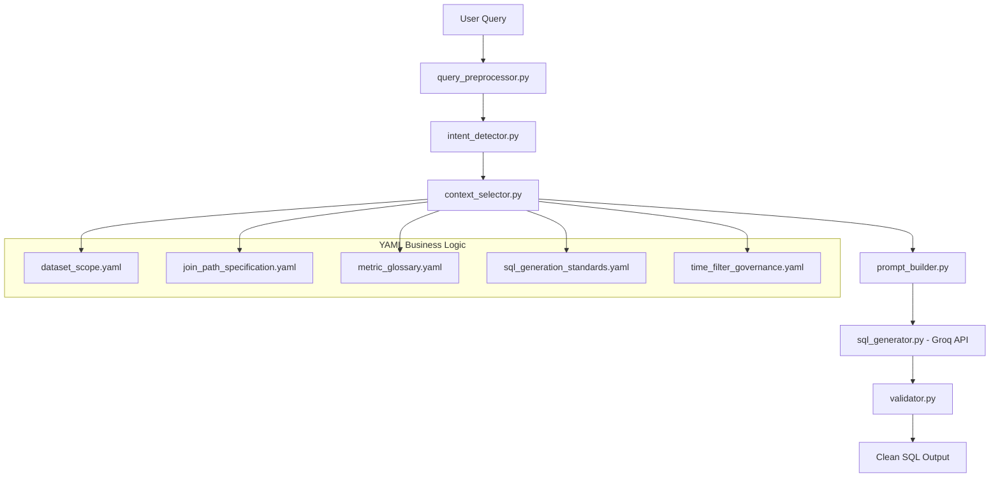

# NL → SQL Analytics System

Production-grade Natural Language to SQL pipeline using Groq (Mixtral-8x7B) + YAML business logic.

---

## Project Structure

```
Business_Copilot/
├── yaml/
│   ├── dataset_scope.yaml             # Defines database schema and available data
│   ├── join_path_specification.yaml   # Strict join rules for tables
│   ├── metric_glossary.yaml           # Business metric definitions
│   ├── README.md                      # Documentation for YAML files
│   ├── sql_generation_standards.yaml  # SQL output rules and standards
│   └── time_filter_governance.yaml    # Time filter logic and rules
│
├── core/
│   ├── context_selector.py            # Extracts relevant YAML context per query
│   ├── filter_extractor.py            # Extracts filters from queries
│   ├── insight_generator.py           # Generates insights from results
│   ├── intent_detector.py             # Detects user intent
│   ├── llm_normalizer.py              # Normalizes LLM responses
│   ├── prompt_builder.py              # Builds structured LLM prompt
│   ├── query_normalizer.py            # Normalizes user queries
│   ├── query_preprocessor.py          # Preprocesses queries
│   ├── scope_validator.py             # Validates query scope
│   ├── semantic_interpreter.py        # Interprets semantic meaning
│   ├── spell_corrector.py             # Corrects spelling in queries
│   ├── sql_generator.py               # Calls Groq API to generate SQL
│   ├── supabase_executor.py           # Executes SQL on Supabase
│   └── validator.py                   # Validates SQL before execution
│
├── main.py                            # Entry point
├── requirements.txt                   # Python dependencies
├── .gitignore                         # Git ignore rules
└── README.md                          # This file
```

---

## Workflow Diagram



---

## Setup

### 1. Install dependencies
```bash
pip install -r requirements.txt
```

### 2. Set your Groq API key
Get your free key at: https://console.groq.com
```bash
export GROQ_API_KEY=your_key_here
```

---

## Run

### Single query
```bash
python main.py --query "Why are we facing losses this month?"
```

### Interactive REPL
```bash
python main.py --interactive
```

### Run all sample queries (demo)
```bash
python main.py --demo
```

### Default (runs first sample query)
```bash
python main.py
```

---

## How It Works

The system processes natural language queries through multiple stages:

1. **Query Preprocessing**: Cleans and normalizes the input query
2. **Intent Detection**: Determines the type of query and required metrics
3. **Context Selection**: Extracts relevant business logic from YAML files
4. **Prompt Building**: Constructs a structured prompt for the LLM
5. **SQL Generation**: Uses Groq API to generate SQL (temperature=0.0 for determinism)
6. **Validation**: Checks SQL against business rules and safety constraints

The YAML files define the business logic, ensuring queries are safe, relevant, and follow company standards.

---

## Example Queries

- "Why are we facing losses this month?"
- "What is our revenue by product category this month?"
- "Which sellers have the highest refund amount this month?"
- "Show me total orders and cancellations for the last 30 days"
- "What is the average order value by customer segment this month?"
- "Which products have the highest return rate last 90 days?"
- "Show seller settlement summary for this month"

---

## Adding New Metrics

Edit `yaml/metric_glossary.yaml`:

```yaml
your_metric:
  description: "What it measures"
  tables: [orders, order_items]
  formula_logic:
    join: "orders.order_id = order_items.order_id"
    filter: "orders.order_status = 'Delivered'"
    aggregation: "SUM(order_items.item_price)"
  type: financial
  aliases: ["keyword1", "keyword2"]   # ← keywords that trigger this metric
```

---

## Extending to Full Analytics

Next steps:
1. Execute SQL on Supabase → add `executor.py` (already present as supabase_executor.py)
2. Pass results to LLM → generate business insights (insight_generator.py present)
3. Add a FastAPI layer → REST API
4. Add a Streamlit UI → frontend
